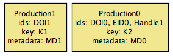
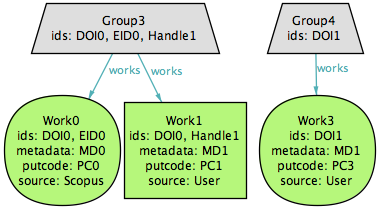

# PTCRISync synchronization framework

A formalization of a an ORCID-based synchronization framework for PTCRIS, as described [here](https://github.com/fccn/PTCRISync/wiki).

## Overview

[PTCRISync](https://github.com/fccn/PTCRISync/wiki) is a synchronization framework that relies on ORCID - a community-based service that aims to provide a registry of unique researcher identifiers (an ORCID iD) and a method of linking research outputs to these identifiers, based on data collected from external sources - as a central hub for information exchange between the various national and international systems, that shall enable researchers (or managers) to register once a given research output at one of the interconnected national systems, and automatically propagate that output to the remaining ones, thus ensuring global consistency of the stored information.

Alloy to explore the design of PTCRISync prior to implementation, namely it was used to formalize *what* was the desired notion of consistency between ORCID and each of the PTCRIS services, and *how* could a synchronization procedure be implemented to enforce such consistency. This Analyzer was also used to automatically generate usage scenarios that were useful for requirement elicitation and validation with the stakeholders. These scenarios can also be used for certifying compliant PTCRIS services, by allowing rigorous testing of the proposed implementations.

The employed strategy is described in this [paper](http://nmacedo.github.io/pubs.html#f1000r15), while the formalization of the framework is available in this [report](http://nmacedo.github.io/pubs.html#inesctec15). This is superseded by the PTCRISync [wiki](https://github.com/fccn/PTCRISync/wiki) that also provides information on the adoption of the framework.

## Example scenario

### Consistent profiles
Two groups of similar works in the ORCID profile, each matched by a production in the PTCRIS profile.

### ORCID update ($\Rightarrow$\texttt{IMPORT} inconsistency)
A new work (`Work2`) is introduced in the ORCID profile that connects the two distinct groups of similar works.

| --- | --- |
|   |  |

### `IMPORT` executed
Since the group of similar works now shares UIDs with both productions at the PTCRIS profile, `IMPORT` creates a modification notification to introduce the missing UIDs for each of the productions.

## History

* Version 0.4.3 is the target of the F1000Research *[An ORCID-based synchronization framework for a national CRIS ecosystem](http://nmacedo.github.io/pubs.html#f1000r15)* paper and the *[PTCRISync specification: An ORCID-based synchronization framework for PTCRIS](http://nmacedo.github.io/pubs.html#inesctec15)* report commisioned by the FCCN|FCT.
* All models have been developed and analyzed under the *Alloy Analyzer 4.2_2015-02-22*.

---

* Language: [[Alloy](https://github.com/nmacedo/MSV/wiki/By-Language#alloy)]
* Theme: [[Synchronization](https://github.com/nmacedo/MSV/wiki/By-Theme#synchronization)] [[CRIS](https://github.com/nmacedo/MSV/wiki/By-Theme#cris)]
* Venue: [[F1000R15](https://github.com/nmacedo/MSV/wiki/By-Venue#f1000r15)] [[INESCTEC15](https://github.com/nmacedo/MSV/wiki/By-Venue#inesctec15)]
