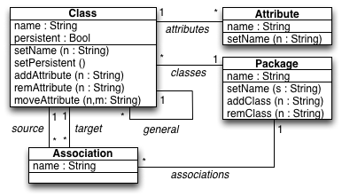
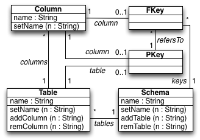
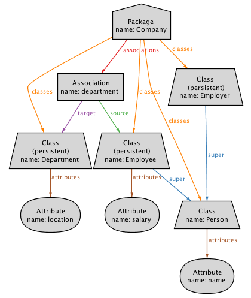
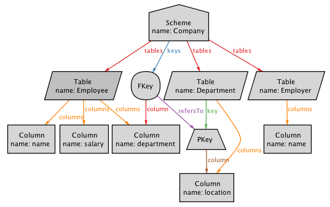

# Object-relational mapping (with associations/keys) 

### UML2RDBMS
The [uml2rdbms_keys.qvtr](Resources/uml2rdbms_keys.qvtr) transformation is a simplified version of the classical object-relational mapping, between class diagrams and database schemes, used as a running example in the QVT standard.

#### Overview
Every persistent Class on the UML class diagram is matched to a Table in the relational database scheme, with a Column for every Attribute, including those inherited from super-classes. Associations between classes are mapped to foreign keys.

The Alloy models demonstrate a solver-based apprach to bidirectional transformations.

#### Meta-models
| [UML.ecore](Resources/UML.ecore) for UML class diagrams | [RDBMS.ecore](Resources/RDBMS.ecore) for relational database schemes |
| --- | --- |
|  |  |

#### Models
| [UML_Company.xmi](Resources/UML_Company.xmi) | [RDB_Company.xmi](Resources/RDB_Company.xmi) |
| --- | --- |
|  |  |

#### History
* This example is a simplified version of the example illustrating the *MOF 2.0 Query/View/Transformation Specification*. 
* This example has been used to illustrate the ASE'13 *[Model repair and transformation with Echo](http://nmacedo.github.io/pubs.html#ase13)* paper.
* A [simplified](../CD2DBS_simple) version has been used to illustrate the SoSyM *[Least-change bidirectional model transformation with QVT-R and ATL](http://nmacedo.github.io/pubs.html#sosym16)* and FASE'13 *[Implementing QVT-R bidirectional model transformations using Alloy](http://nmacedo.github.io/pubs.html#fase13)* papers, and N. Macedo's *[PhD Thesis](http://nmacedo.github.io/pubs.html#phd14)*.

<!-- Warning: resource URIs -->

---

* Language: [[Alloy](https://github.com/nmacedo/MSV/wiki/By-Language#alloy)] [[Ecore](https://github.com/nmacedo/MSV/wiki/By-Language#ecore)] [[QVT](https://github.com/nmacedo/MSV/wiki/By-Language#qvt)]
* Theme: [[Bidirectional Transformation](https://github.com/nmacedo/MSV/wiki/By-Theme#bidirectional-transformation)] [MDE]
* Venue: [[ASE13](https://github.com/nmacedo/MSV/wiki/By-Venue#ase13)]
