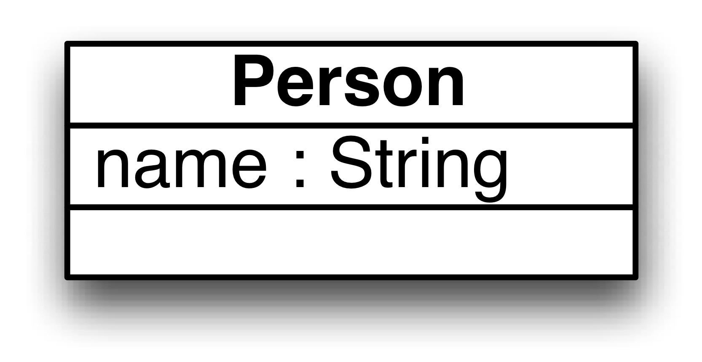
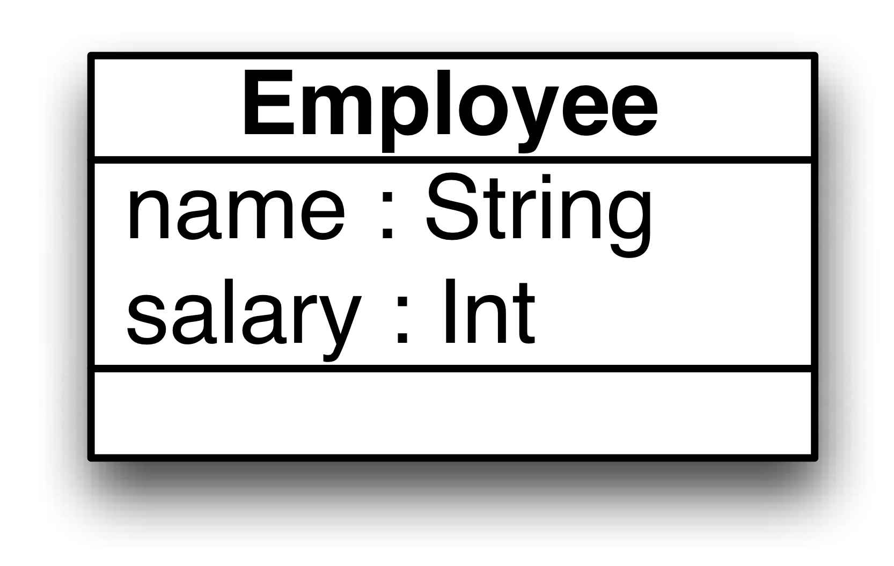

# Company human resources synchronization (minimal)

A very minimal example for company human resources synchronization.

### Description

The [WorldToCompany.atl](Resources/WorldToCompany.atl) transformation is a (very) simplified transformation between person and employees registers.

Meta-models and models are specified in the Eclipse Modelling Framework (EMF).

Every person is mapped to a employee with the same name, which additionally have salaries.

#### Meta-models
| [World.ecore](Resources/World.ecore) for world models | [Company.ecore](Resources/Company.ecore) for company models |
| --- | --- |
|  |  |

### Development history
* This example has been used to illustrate the SoSyM *[Least-change bidirectional model transformation with QVT-R and ATL](http://nmacedo.github.io/pubs.html#sosym16)* paper and N. Macedo's *[PhD Thesis](http://nmacedo.github.io/pubs.html#phd14)*.

---

* Language: [[Ecore](https://github.com/nmacedo/MSV/wiki/By-Language#ecore)] [[ATL](https://github.com/nmacedo/MSV/wiki/By-Language#atl)]
* Theme: [[Synchronization](https://github.com/nmacedo/MSV/wiki/By-Theme#synchronization)] [[Bidirectional Transformation](https://github.com/nmacedo/MSV/wiki/By-Theme#bidirectional-transformation)] [[MDE](https://github.com/nmacedo/MSV/wiki/By-Theme#mde)]
* Venue: [[SoSyM16](https://github.com/nmacedo/MSV/wiki/By-Venue#sosym16)] [[PhD14](https://github.com/nmacedo/MSV/wiki/By-Venue#phd14)]
