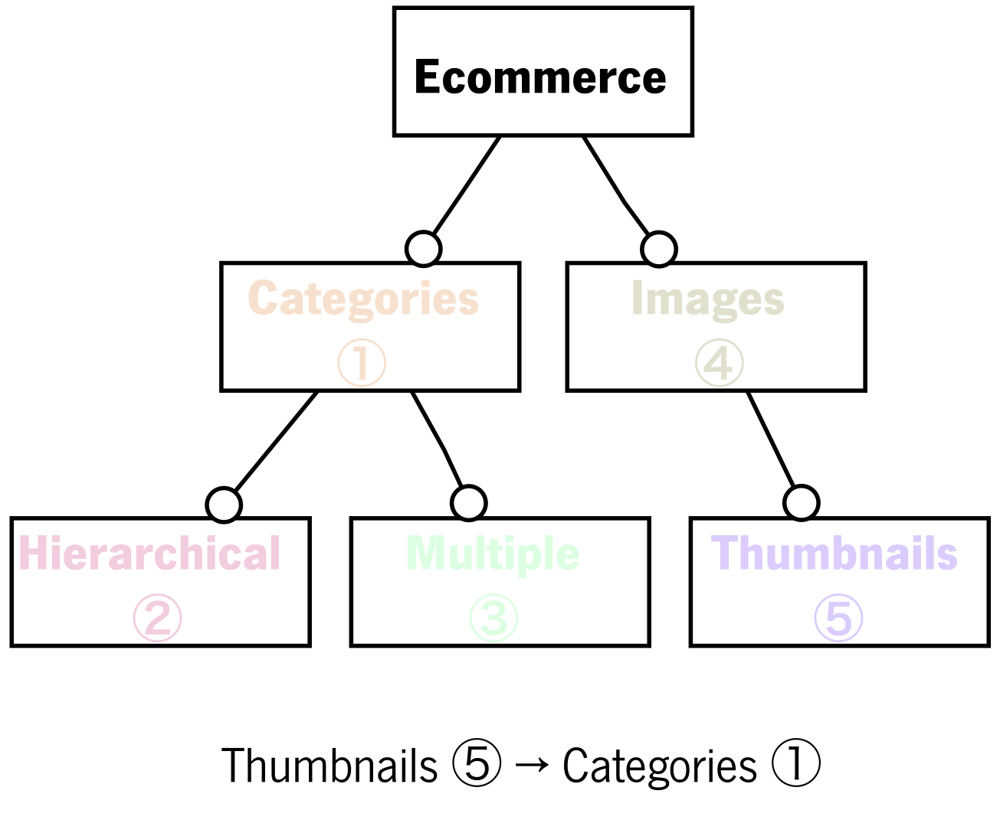

# E-commerce platform

Models of a multi-variant e-commerce platform inspired by the running example of the paper _Verifying feature-based model templates against well-formedness OCL constraints_ by Czarnecki & Pietroszek.

### Description

The model explores different features of the e-commerce platform, namely whether to support
1. categories of products
2. a hierarchy of categories
3. products with multiple categories
4. product images
5. product thumbnails

These features are organized according to the following feature model:

### Development history
* The original ??? model is a running example in the paper _Verifying feature-based model templates against well-formedness OCL constraints_ by Czarnecki & Pietroszek.
* Colorful Alloy models were developed for the [_???_](http://nmacedo.github.io/pubs/setta19.pdf), and used in the benchmarks.
* Colorful Alloy models have been developed and analyzed under first release of *Colorful Alloy Analyzer (July 2019)*.

---

* Language: [[Colorful Alloy](https://github.com/nmacedo/MSV/wiki/By-Language#colorful-alloy)]
* Theme: [[SPL](https://github.com/nmacedo/MSV/wiki/By-Theme#spl)]
* Venue: [[SETTA19](https://github.com/nmacedo/MSV/wiki/By-Venue#setta19)] 
