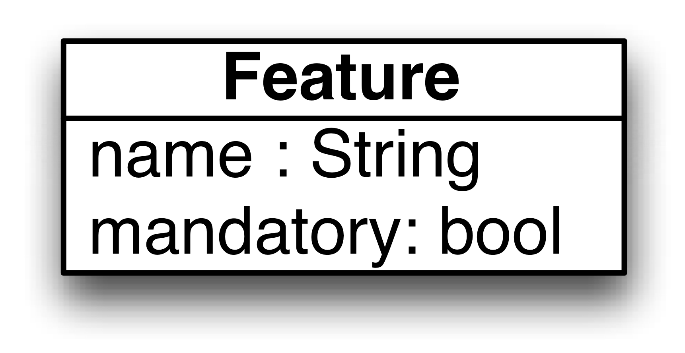
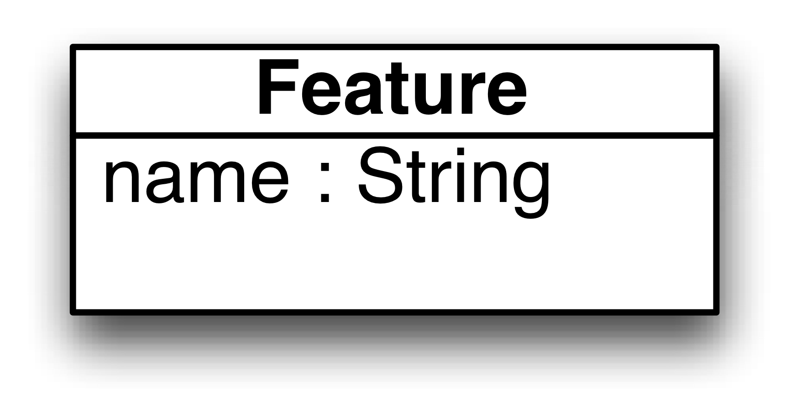

# SPL development (minimal)

A very minimal example related to SPL engineering.

### FM2CFs
The [fm2cfs.qvtr](Resources/fm2cfs.qvtr) transformation is a (very) simplified SPL scenario between a feature model and 2 system configurations.

The Alloy models demonstrate a solver-based apprach to multidirectional transformations.

#### Overview
Every mandatory feature on the feature model must be present in the configurations, while every feature selected in the configuration must belong to the feature model.

#### Meta-models
| [FM.ecore](Resources/FM.ecore) for feature models | [CF.ecore](Resources/CF.ecore) for the first configuration | [CF.ecore](Resources/CF.ecore) for the second configuration |
| --- | --- | --- |
|  |  |  |

#### Models
| [FM.xmi](Resources/FM.xmi) | [CF1.xmi](Resources/CF1.xmi) | [CF2.xmi](Resources/CF2.xmi) |
| --- | --- | --- |

#### History
* This example has been used to illustrate the BX'14 *[Towards a framework for multi-directional model transformations](http://nmacedo.github.io/pubs.html#bx14)* paper and N. Macedo's *[PhD Thesis](http://nmacedo.github.io/pubs.html#phd14)*.

---

* Language: [[Alloy](https://github.com/nmacedo/MSV/wiki/By-Language#alloy)] [[Ecore](https://github.com/nmacedo/MSV/wiki/By-Language#ecore)] [[QVT](https://github.com/nmacedo/MSV/wiki/By-Language#qvt)]
* Theme: [[Bidirectional Transformation](https://github.com/nmacedo/MSV/wiki/By-Theme#bidirectional-transformation)] [[Multidirectional Transformation](https://github.com/nmacedo/MSV/wiki/By-Theme#multidirectional-transformation)] [MDE] 
* Venue: [[BX14](https://github.com/nmacedo/MSV/wiki/By-Venue#bx14)] [[PhD](https://github.com/nmacedo/MSV/wiki/By-Venue#phd14)]
