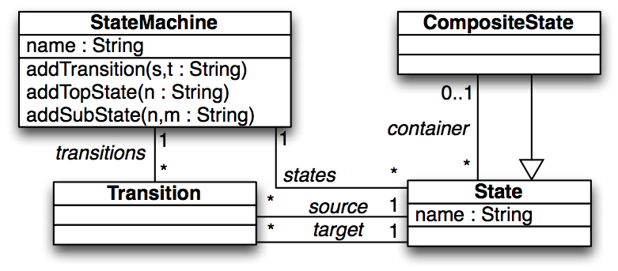
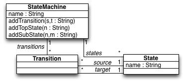
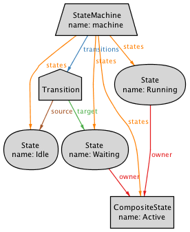

# Expand/collapse hierarchical state machines

The HSM2NHSM transformation specifies the collapse/expansion of hierarchical state diagrams.

#### Overview
Every top-level State on the expanded state diagram is matched to a State in the collapsed state diagram with the same name. Transitions at the expanded sate diagram pushed up from nested States to the top-level States at the collapsed state diagram.

Several versions of the transformation are provided. The [hsm2nhsm_closure_2mm.qvtr](Resources/hsm2nhsm_closure_2mm.qvtr) transformation provides a QVT-R version that relies on *transitive closure* to retrieve Transitions from nested states. The [hsm2nhsm_recursion_2mm.qvtr](Resources/hsm2nhsm_recursion_2mm.qvtr) transformation relies instead on *recursion*. The [hsm2nhsm_closure_1mm.qvtr](Resources/hsm2nhsm_closure_1mm.qvtr) transformation considers non-hierarchical state diagrams to conform to the same meta-model as the hierarchical ones. Lastly, the [hsm2nhsm_recursion.atl](Resources/hsm2nhsm_recursion.atl) transformation provides a ATL version that relies on *recursion*.

#### Meta-models
| [HSM.ecore](Resources/HSM.ecore) for expanded (hierarchical) state diagrams | [NHSM.ecore](Resources/NHSM.ecore) for collapsed (non-hierarchical) state diagrams |
| --- | --- |
|  |  |

#### Models
| [HSM_expanded.xmi](Resources/HSM_expanded.xmi) | [NHM_example.xmi](Resources/NHM_example.xmi) |
| --- | --- |
|  |  |

#### History
* This example is based on the running example from the paper *JTL: a bidirectional and change propagating transformation language* by A. Cicchetti, D. Di Ruscio, R. Eramo and A. Pierantonio.
* This example has been used to illustrate the SoSyM *[Least-change bidirectional model transformation with QVT-R and ATL](http://nmacedo.github.io/pubs.html#sosym16)* paper and N. Macedo's *[PhD Thesis](http://nmacedo.github.io/pubs.html#phd14)*.

---

* Language: [[Ecore](https://github.com/nmacedo/MSV/wiki/By-Language#ecore)] [[QVT](https://github.com/nmacedo/MSV/wiki/By-Language#qvt)] [[ATL](https://github.com/nmacedo/MSV/wiki/By-Language#atl)]
* Theme: [[Bidirectional Transformation](https://github.com/nmacedo/MSV/wiki/By-Theme#bidirectional-transformation)] [MDE] 
* Venue: [[SoSyM16](https://github.com/nmacedo/MSV/wiki/By-Venue#sosym16)] [[PhD14](https://github.com/nmacedo/MSV/wiki/By-Venue#phd14)]
